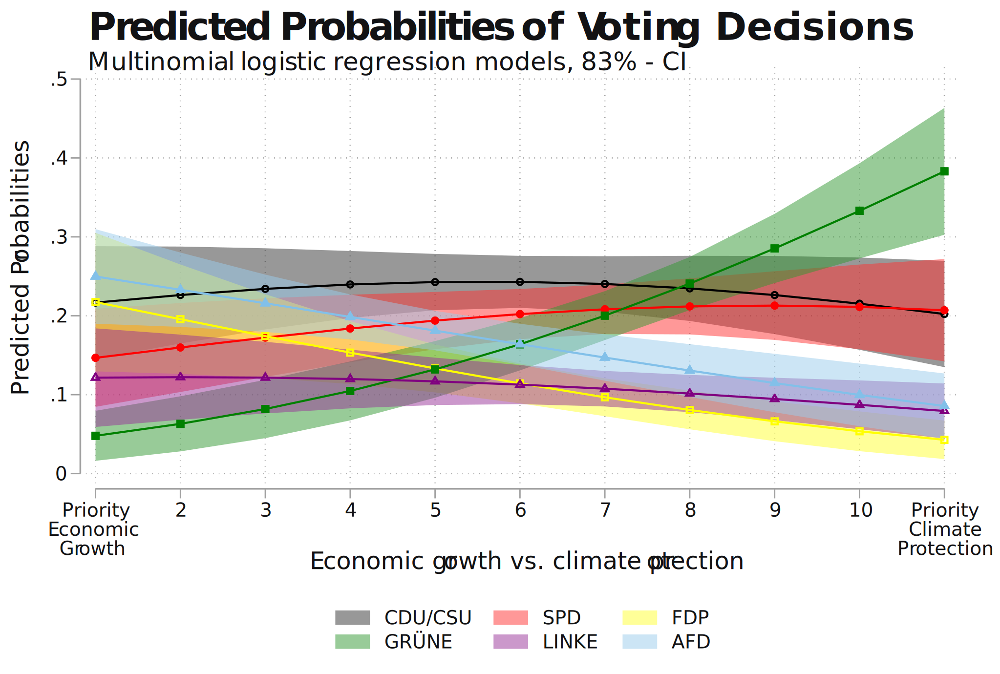

Welcome to my Data Portfolio! 

I'm Lucas Schwarz, a passionate data enthusiast with a background in Political Science and Political Communication from Mainz, Germany. Within this repository, I present a compilation of my data analysis and data science projects, showcasing my utilization of statistical analysis, machine learning algorithms, and data visualization techniques to derive insightful conclusions. These projects were conducted during my studies in Political Science and Political Communication, demonstrating my dedication to a data-driven research approach and my adeptness in handling diverse datasets and methodologies.

Explore my portfolio to witness my approach to various challenges, including statistical modeling, classification tasks, network analysis, and data storytelling. Whether analyzing voter potentials in data-driven campaigning contexts, examining communication strategies of political candidates across platforms, or assessing the impact of tax systems on equality, each project underscores my commitment to delivering impactful insights within the realm of political data analysis.

Happy exploring!

**Project Overview:**
|| Projects | Year | Status | Code provided |
|--:|:---|:---:|:---:|:---:|
|01| [Data Driven Campaigning](#01---data-driven-campaigning-2023) | 2023 | finished  | no  |
|02| [Dynamics in Televised Election Debates](#02---dynamics-in-televised-election-debates-2022)  | 2022 | finished | no |
|03| [Position becomes Emotion? - Affective Polarization in Comparative Perspective](#03---position-becomes-emotion---affective-polarization-in-comparative-perspective-2023) | 2023  | finished  | no |
|04| [Analyzing Political Communication on Twitter with NLP](#04---analyzing-political-communication-on-twitter-with-nlp-2024) |  2024  | currently in progress  | [yes](https://github.com/TheLucasSchwarz/polcom-twitter-nlp) | 
|05| [From Tax to Equality](#05---from-tax-to-equality-2024)  |  2024  | finished | [yes](https://github.com/TheLucasSchwarz/taxequality) | 
|06| [Economic Causes of Populist Voting Behavior](#06---economic-causes-of-populist-voting-behavior-2022-and-2023) | 2022 and 2023 | finished | no |

> [!IMPORTANT]
> Be aware that this portfolio is still in progress. If there is something missing or you have any questions, feel free to contact me. I am happy to provide more information or insights.

<!-- Feel free to delve into the code, explore the methodologies employed, and engage with the insights generated. I invite you to embark on this journey through the captivating world of data projects in Political Science, where each dataset harbors the potential to discover ne knowledge and insights.

Happy exploring! -->

## 01 - Data Driven Campaigning (2023)

In this group project as part of a seminar on data-based election campaign planning, an election campaign for B90/The Greens was planned for a fictitious federal election in 2023. 

SWOT analyses as well as descriptive and inferential statistical methods were used to determine the strengths and weaknesses as well as the voter potential of the Greens. The election campaign was then planned precisely on the basis of the findings and corresponding election posters were designed.

The analyses were carried out using Stata on the basis of the GLES tracking individual dataset from October 2022. The core of the analysis is the multiple multinomial logistic regression model, in which the probabilities of individual voting decisions were modeled using several variables. For a better understanding, the exemplary selected predicted probabilities plot and studies on various attributions of issue competencies of the parties were also used.

The project won first place in the competition with the other teams. 

*As this is a team project, I do not wish to publish more detailed results and graphics.*

## 02 - Dynamics in Televised Election Debates (2022)
The project was my bachelor thesis, in which I first analyzed all three TV debates for the 2021 German federal election qualitatively according to my own coding scheme for the communication of candidates in TV debates.

I then quantitatively evaluated the counted categories, developed my own communication typology based on the results and analyzed the dynamics of the actors in R. The central result is that, triggered by the political proximity of the Greens and the SPD, Armin Laschet was the focal point of all debates. Annalena Baerbock's attacks were mainly directed at him, while Olaf Scholz focused primarily on himself and only sometimes responded to Laschet's attacks.

*As the project is still potentially being submitted to academic journals, I am unfortunately unable to make the code, graphics and more detailed information public at this point.*

## 03 - Position becomes Emotion? - Affective Polarization in Comparative Perspective (2023)
This group project investigated the causes of emotional (affective) political polarization between voters. The focus was on the extent to which individual ideological dispositions affect affective polarization and the extent to which this relationship is moderated by different campaign contexts. To this end, multiple linear multi-level regression models were calculated on the basis of an expert survey and individual data from over 25 countries. 

With the help of cross-level interaction effects between the context variable of the negativity of the election campaign and the individual ideological extremism of a respondent, the following could be determined, among other things: In particularly negative campaign contexts (countries), significant differences in individual levels of affective polarization occurred depending on how ideologically extreme a person is.

It can be concluded from this that excessively negative communication on the part of political elites can certainly reinforce social division processes.

*As this is a team project, I do not wish to publish more detailed results and graphics.*

## [04 - Analyzing Political Communication on Twitter with NLP (2024)](https://github.com/TheLucasSchwarz/polcom-twitter-nlp)

This project, which is currently being implemented, aims to use natural language processing to analyze over 330,000 self-collected tweets from all Bundestag candidates represented on Twitter (X) in 2021. The project is split into two parts and training/deployment runs via the Google Cloud Platform (GCP):

First, I have classified all tweets according to their political content with PyTorch using the already pre-trained manifestoberta model. These will now be analyzed with logistic multi-level regressions to examine the determinants of specific content across the election campaign. Manifestoberta is based on the multilingual XLM-RoBERTa-Large models, which were tuned on all annotated statements in the text corpus of the MANIFESTO project.

As a second project, I will train and deploy my own model for the classification of negative campaigning based on the tweets using SpaCy. The final goal is to analyze all classified tweets for determinants and dynamics of campaign communication using network analysis and regression models. 

## 05 - [From Tax to Equality (2024)](https://github.com/TheLucasSchwarz/taxequality)

I investigated the impact of diverse tax policies on wealth inequality by analyzing macro-country data sourced from various reputable outlets. Employing a multiple linear fixed-effects panel model, I scrutinized data spanning over 25 OECD countries and approximately 25 years. This approach allowed for a comprehensive understanding of the intricate relationship between tax policies and wealth distribution dynamics.
 
## 06 - Economic Causes of Populist Voting Behavior (2022 and 2023)
In two projects I investigated left-wing and right-wing populist voting behavior in Europe, exploring the role of globalization, welfare states, and individual circumstances through multiple linear and multinomial regression models.
